**Learning Objective**

To introduce ArcGIS Pro and its basic data management, display, and analysis
components. To learn how to work with map layers, query attribute tables
and geographic features, create maps, and design and execute a simple
GIS analysis. As a demonstration, you will map and analyze data from
Philadelphia, Pennsylvania.

First, complete the tutorial by following the steps below. Then, using
the skills you’ve learned in the tutorial, complete the assignment given
following the tutorial.

# TUTORIAL
## Prepare the ArcGIS Pro
In this class, we are going to use the commercial GIS desktop ArcGIS Pro for the lab, although there are some other open-sourced options, like [QGIS](https://qgis.org/en/site/). You can access ArcGIS Pro through the university's computer or install the ArcGIS Pro on your own computer (preferred). 

1. **Install ArcGIS Pro on your computer**: It is fairly easy for you to obtain ArcGIS to load on your personal machine. If at all possible, that's the easiest, fastest, most hassle-free option. Regardless, to install your own version, you need a Window OS. Typically, that would mean that you have a PC. But if you have a Mac, depending on the hardware, you can create a Windows partition and install ArcGIS Pro to it. I've never done it, but I've had students succeed by getting help at the TU HelpDesk. 
ArcGIS Pro and Desktop are available for self-service download and install by anyone (including all students) with a valid @temple.edu (Links to an external site.) address. To Download and install ArcGIS from the ArcGIS Online portal:
- Sign into ArcGIS Online @ https://temple.maps.arcgis.com/
- Click on your User Account Icon in the top right
- Click My Settings > Licenses > Download ArcGIS Pro

2. **Access the university's computer**. If for some reason you cannot install ArcGIS on your own machine or if you would prefer to access remotely, go to  remotelabs.temple.edu. Before you do, it's worthwhile to look over these instructions:  https://its.temple.edu/remote-labs. If you have any trouble accessing the Remote Labs, please contact your instructor or contact the desk help [**link**](https://its.temple.edu/technical-support). 

## Acquiring the Data

1.  Create a **workspace**, which is a technical way of referring to a
    project folder, the folder where you store your data files,
    including both inputs and outputs. Thus, when you see a reference to
    'your workspace' here, you can think of it as 'your Lab1 data
    folder'. Using the term 'workspace' is more concise, and when you
    become a more advanced GIS user, setting the workspace becomes an
    important part of automating complex processes. If you are working
    on campus on a TU computer, it is best to use a USB flash
    drive and create a new workspace folder named 'Lab1'.  If you do not
    have a flash drive create a new folder in the Documents folder. (On
    the Temple lab computers, Documents is located at
    C:\\data\\Documents.) For future labs, create new workspace folders
    – Lab2, Lab3, etc.
2.  Here we will acquire the following spatial data layers for the city
    of Philadelphia: schools, bike routes, and neighborhoods. We will
    download data from **PASDA** (The Pennsylvania Geospatial
    Clearinghouse), which is an example of a **geoportal**, a website
    that collects geospatial data from many different sources organized
    around a particular theme or region of interest. Unsurprisingly,
    PASDA, hosts data related to Pennsylvania, and is maintained by
    Pennsylvania State University. PASDA hosts data provided by local
    governments, federal and state agencies, nonprofits, and academic
    institutions.
3.  Go to <http://www.pasda.psu.edu>. NOTE: in the center of the PASDA home page, you will see, in red font, "Alert: Problem downloading files in some browsers. Click for more information". If you click on a file to download it and nothing happens, follow this link for instructions on making changes to how your browswer interacts with PASDA's ftp server. This may happen if you are using either the Google Chrome or the MS Edge browswer.
   

4.  Under 'SEARCH BY KEYWORD(S)' enter
    'Philadelphia' and press submit. 
     Find 2016 Philadelphia Planning - Schools, click on the link, press
    'Download', which will download a file.
5.  In addition to schools, find and download the following:
      - 2016 Philadelphia Streets - Bike Network
      - 2016 Philadelphia Planning - Neighborhoods
6.  You should have downloaded 3 files:
      - PhillyPlanning\_Schools.zip
      - PhillyPlanning\_Neighborhoods.zip
      - PhillyStreets\_Bike\_Network.zip
7.  Notice all 3 files are .zip files, which is a single file that is
    composed of one or more individual files that have been compressed
    to a smaller storage size for convenience. The lab computers will
    automatically save the zip files to the Downloads folder. Copy or
    move these files to your Lab1 workspace folder.
8.  Unzip the archive. The lab computers have 7-Zip installed on them.
    In File Explorer, right-click the file and choose **7-Zip → Extract
    Here or 7-Zip → Extract to 'folder\_name'**.
9.  Unzip each of the .zip files using the 7-zip application (or another
    appropriate application) and extract the files to your workspace
    folder.

## Opening the ArcGIS Pro and Exploring Data in the Catalog View

1.  Open ArcGIS Pro. You can navigate to ArcGIS Pro through the Start
    button at the lower left of the screen, then go to ArcGIS.

2.  The ArcGIS Pro start page will appear.  In the **New** menu, under **Blank Templates**, click **Catalog**. 
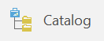

3.  The **Create a New Project** dialog will appear. Name your project 'Lab1'.  To specify the project's location, navigate to the location of your Lab1 workspace folder.  Click on the folder named 'Lab1' and click OK. 

4.  Uncheck the box that says 'Create a new folder for this project', as we have already created a workspace folder for Lab 1. **Note:** If you wish to create a new folder for a project in the future, you will need to set the location to the folder that will contain the new project folder, and leave this box checked.

5.  The catalog view will open, showing the items contained within your new project.  In the **Contents** pane on the left side, under the **Project** heading, double-click on **Folders**, and then double-click on the 'Lab1' folder.

6.  Clicking on a folder in the **Contents** pane will show the files contained in that folder in the catalog view window. You will be able to see each spatial data layer you've downloaded, something like this:
    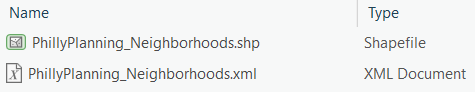
    
7. Each of these spatial data layers is a **shapefile**, which is a
    particular GIS file format. There are other such formats, but
    shapefiles are very common. You’ll notice different symbols for each
    type of layer. The neighborhoods file is a **polygon** layer, the schools file is a
    **point** layer, and the bike network file is a **line** layer.

8.  Click once on the neighborhoods layer (PhillyPlanning_Neighborhoods.shp) and click on the **Geography** tab at the top of the details pane on the right so
    that the layer appears like this:  
    
    
9.  Switch to the **Table** tab. Now you see the attribute table
    for this layer. Each row represents one polygon, or neighborhood, in
    the map. The number of rows, i.e. neighborhoods, appears at the
    bottom (148).
    
10. Scroll to the right to see the different columns (called **fields**).
    Find the column with the heading `Name`. These are the names of the different neighborhoods.
    
11. Explore the map and attribute data for the schools and bike network data.

> **Views** 
>
> ArcGIS Pro displays data in different types of windows, known as **views**, 
> to represent different aspects of a project. We began by previewing an 
> organizational representation of our files in a **catalog view**, but a
> common way to interact with data visually is through a **map view**. When we 
> want to create a document from our map that we can export to other 
> applications, we will use a **layout**, which is another type of view 
> designed for creating a finished map product. Tables are another kind of 
> view in ArcGIS that allow us to display the stored data associated with our > map layers. Although you can have many different views associated with a 
> single project and many tabs open at once, only one will be active at a 
> time.

## Adding Map Layers in the Map View

1.  On the ribbon, click on the **Insert** tab. Then click the **New Map** button. **Note:** Make sure you click on the button icon, and not the label.

2.  A new map will appear in a map view tab with two default basemap layers. 

3.  On the ribbon, click the **Map** tab, then click the **Add Data** button.
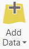

4. In the **Add Data** browser window, navigate to your workspace folder and add the neighborhoods, schools, and bike network data layers to the map. 

5.  After adding the files, it should look something like this (the colors may be different):
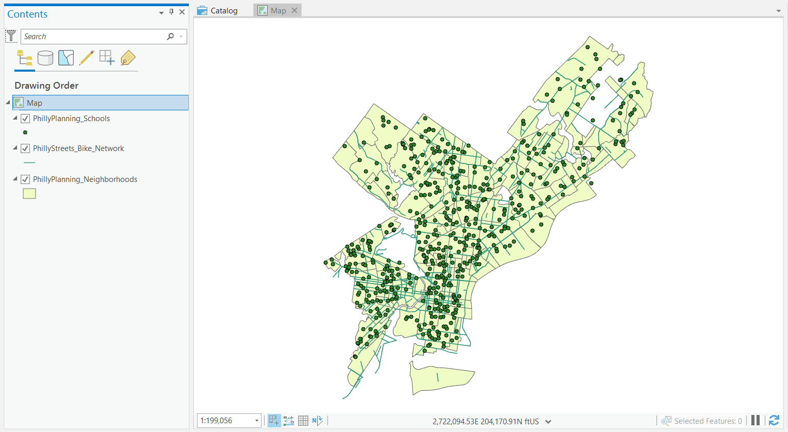

> **Contents pane**
> 
> The left pane in ArcGIS Pro is called the Contents pane.  When a map 
> view is active, the **Contents** pane lists all the map layers found in the 
> map window and shows what the geographic features in each map layer 
> represent (points, lines, polygons, images, tables).  The **Contents** pane 
> helps you manage the display order of map layers and symbols used to represent 
> layers, as well as set the display and other properties (e.g. color, 
> line thickness) for each map layer.  It is also the place where you can 
> easily see the drive paths where your files are physically located on the 
> computer (e.g., C:\\temp\\mygisfiles).
> **It is very important to remember where your files are located when you are 
> working on a GIS project. In a GIS environment you will be doing a lot of data
> processing which requires the creation of new files, which must be
> saved. If you don’t know where you saved a file, your instructor is
> not going to know either.**
> When another view is active, such as the catalog view, the **Contents**
> pane will change to display the elements related to that view. 

## Working in the Contents pane

At the top of the **Contents** pane is a toolbar that controls how the layers are listed, and what you can do to them. You can hover over the buttons to see tooltips for their function:

  - List By Drawing Order
  - List By Data Source
  - List By Selection
  - List By Editing
  - List By Snapping
  - List By Labelling

In a new map, the **List By Drawing Order** button should be selected:

1.  Select the **List By Drawing Order** button if it is not already
    selected (if, for example, you have done the steps out of order, or someone used this computer previously).
2.  Try changing the order of the map layers. Click, hold, and drag the
    neighborhoods layer to the top. Notice that now that it is 'on top' it
    visually obscures the other layers (schools and bike network) below
    it. Drag and drop the schools and bike network layers to the top
    again.
3.  Select the **List By Data Source** button.
4.  Note the path, i.e. the drive and folder hierarchy, within which
    each layer is stored.
5.  You can also turn layers on and off (i.e. make them visible or not)
    by simply checking or unchecking the box next to the layer name in
    the **Contents** pane. This does not remove the layer from your project.

> **What are ArcGIS Pro project files? (.aprx files)**
> 
> ArcGIS Pro projects (which have the .aprx extension) allow desktop users
> to save and share their GIS project with other desktop users, reopen
> a project at a future time, or share maps to ArcGIS Online. After an 
> ArcGIS Pro project is created and various map properties are defined (map 
> colors, projection), all of the properties of the GIS map are saved as 
> part of the project file. Remember that the project file (.aprx) only 
> saves ArcGIS project properties and the location of the map layers that 
> are being used and does not save the geospatial data (that is, the data 
> in the shapefiles or other geospatial data format). The ArcGIS project 
> will only reference the location where the data files are saved. If you
> move your data files to a different drive path or folder and then open
> your project, you will have to locate the files again.

## Saving a Project File

1.  Click the **Save** icon in the top toolbar (Keyboard shortcut: Ctrl+S)
 
2.  Close the ArcGIS Pro software completely.

## Opening your ArcGIS project file (.aprx file)

As with Microsoft Word or other Windows applications, if you have an
existing project file, you can open it directly from the desktop. You do not have to have ArcGIS already open.

1.  In File Explorer, navigate to your map document file (Lab1.aprx).
2.  Double-click the file to launch ArcGIS Pro and open your existing document.

Again, as with other Windows applications, you can open an existing map
document from the start page. The **Open** menu will also list recently opened projects.

Do *NOT* attempt to open a shapefile by double-clicking in File
Explorer. You cannot open shapefiles directly. You must read a shapefile using GIS software such as ArcGIS Pro.

## Remove Map Layers from a Map view

1.  Right-click PhillyPlanning_Neighborhoods on the **Contents** pane, and click **Remove**.
2.  Close ArcGIS Pro completely. Do not save your changes.

> **Organizing GIS data**
> 
> One of the most challenging parts of learning GIS is organizing your
> files and understanding where they are stored. You will find out in
> the next few weeks that when you perform spatial operations and/or
> geoprocess your data ArcGIS often creates new files. You need to stay
> organized (check you paths and know where the data are being stored).
> The faster you get this concept, the quicker you will learn the more
> important GIS concepts.
> 
> There are many different spatial data formats. Vector data (points,
> lines and polygons) are commonly stored in **shapefiles**. A shapefile
> is a simple, nontopological format (topology will be explained later
> this term) for storing the geometric location and attribute
> information of geographic features. Geographic features in a shapefile
> can be represented by points, lines, or polygons.
> 
> The shapefile format defines the geometry and attributes of
> geographically referenced features in three or more files with
> specific file extensions that should be stored in the same folder.
> Each file must have the same base name in order for ArcGIS to
> recognize them as part of the same spatial layer, for example,
> schools.shp, schools.shx, and schools.dbf.
> 
> The following are common shapefile extensions. The first three (.shp,
> .shx, .dbf) are *required* by the shapefile standard:
> 
>   - .shp—The main file that stores the feature geometry; required.
>   - .shx—The index file that stores the index of the feature \>
>     geometry; required.
>   - .dbf—The dBASE table that stores the attribute information of
>     features; required.
>   - .prj—The file that stores the coordinate system information.
>     *All* spatial data use *some* CRS (coordinate reference
>     system), but shapefiles are sometimes distributed without the .prj
>     file. How to deal with that will be demonstrated in a future
>     exercise.
>   - .sbn and .sbx—The files that store the spatial index of the
>     features.
>   - .xml—**Metadata** ('data about data') for ArcGIS—stores
>     information about the shapefile, such as the source of the data,
>     accuracy, publication date, time period, etc.

## Viewing Shapefiles between Folders

This section aims to show you that shapefiles are composed of many files
that you must transport all together in one group to another location.
Additionally, it is important to note where all of the files are stored
for each project that you work on.

1.  Open File Explorer and navigate to your workspace folder and examine
    the schools shapefile. There should be 8 files with the base name
    PhillyPlanning_Schools. These files must be kept together to be
    maintained. *THE LOSS OF ANY ONE OF THESE 8 FILES CAN BREAK THE
    SHAPEFILE.*
2.  Open ArcGIS Pro and the Lab1 project and click on the catalog view tab (If you have closed the 
    catalog tab, click on the **View** tab on the ribbon and then click **Catalog View** to reopen it).
3.  Navigate to your workspace in the catalog window so you can view the
    schools shapefile. Note that only the .shp file and the .xml file appear in the catalog view, even though the shapefile is actually composed of 8 individual files.
4.  In the catalog view you can rename, copy, and move shapefiles, just
    as you
    can in File Explorer, and it will automatically maintain the
    integrity of all files that compose the shapefile. It is recommended
    to use the catalog view to rename, copy, and move GIS data files (though
    it is still possible to use File Explorer for this purpose).
5.  Close ArcGIS Pro and save the changes to your project.

## Repairing Broken Data Links

ArcGIS Pro should be closed when you begin this section. Your
Lab1 workspace folder should have a project file named Lab1.aprx which is
linked to data in that folder. We are going to break that link and learn
how to repair it.

We are going to break the link by moving the ArcGIS project file. It could also
be broken by moving the data to a new folder, or, if the data were not
in the same folder as the map document, by renaming the data folder. It can also be
broken just by plugging your flash drive into a new computer and having
it mount on a different drive letter. All of these are very common
occurrences, so it is very likely that you will encounter broken data
links when working with GIS.

1.  In File Explorer, move Lab1.aprx to the parent folder of Lab1. For
    example, if Lab1 is in a folder named GIS\_Class, move Lab1.aprx to
    GIS\_Class.
2.  Double-click Lab1.aprx to open ArcGIS Pro. Notice that the map window is
    empty except for the default basemap layers, and all of our data layers have a red exclamation mark next to
    them in the **Catalog** pane. This indicates that a layer is defined in the map document,
    but the source data is not at the expected location. Any layer
    properties, such as the color of polygon features, are preserved,
    even if ArcGIS Pro can’t find the polygons to display\!  
    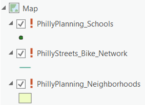
    
3.  In the **Catalog** pane, click on the red exclamation point next to any of the
    missing data layers. 
    
4.  Navigate to the correct shapefile for the layer you clicked on. Click OK.

5.  Notice that ArcGIS Pro has repaired the link for not just that layer,
    but for all the other layers as well. The **Repair Data Source** feature
    will check whether other map document layers come from the same data
    source. In this case, since all of the shapefile folders share a parent
    folder, all of the data links were repaired.
6.  Close ArcGIS Pro **but do not save your changes**.
7.  Move Lab1.aprx back into the Lab1 folder.

There is another way to repair a broken link, which involves going into
the layer properties and changing the path in the **Source** tab. This would
have to be done once for each layer, and is usually less convenient.
More information is available at "[Repairing broken data
links](https://pro.arcgis.com/en/pro-app/help/mapping/layer-properties/repair-broken-data-links.htm)".

## Changing the Symbology of Map Layers

In ArcGIS it is very easy to change the colors and symbols of map
layers. Let’s try changing the color and symbols of the map layers in
your Lab1 map.

### Change Color

1.  Open ArcGIS Pro and the Lab1 project. Turn off the bike network and schools layers so only the neighborhoods layer is showing on top of the basemap.
2.  Right click the neighborhoods layer in the **Contents** pane and click 
    **Symbology** in the drop-down menu. (You can also single click on the layer 
    click on the contextual **Appearance** tab on the ribbon, and then click 
    on the **Symbology** button.) 
    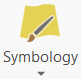
3.  The **Symbology** pane will appear on the right side of the screen. 
4.  Click on the box next to **Symbol** that shows a preview of the current polygon symbology for the neighborhoods layer.  This will open the **Format Polygon Symbol** mode. 
5.  Click on the **Properties** tab.  The **Appearance** section will allow you to customize the look of the polygon symbology.
6.  Click on the box next to **Color**, then select a new color from the color palette for the polygon fill.
7.  Click on the box next to **Outline color**, then select a new color from the color palette for the outline.
8.  Make sure to choose a fill and outline color that makes it easy to
    see the individual neighborhoods. The bottom section of the symbology pane allows you to preview your color combination before applying changes.
9. Click **Apply** to see the new color settings on the map.

### Change Point Glyph (Symbol) and Color

1.  Turn off all the layers except for the schools layer and the basemap layers. 
2.  Click on the schools layer in the **Contents** pane. 
3.  The symbology pane should now display the symbology options for the schools layer. 
4.  Click on the point symbol next to **Symbol** that shows a preview of the current point symbolgy for the schools layer. This will open the **Format Point Symbol** mode.
5.  Click on the **Gallery** tab. Scroll down and change the glyph.
6.  Switch to **Properties** tab and change the fill color.
7.  Make sure to choose a glyph and fill color that makes it easy to see
    the individual schools on top of the basemap.
8.  Click **Apply** to see the new color settings on the map.

> **Using the Ribbon Tabs and Panes**
>
>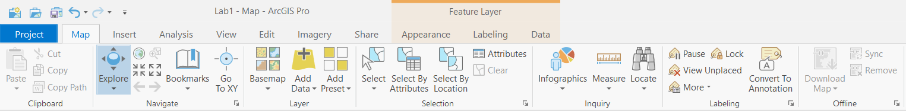
>
> ArcGIS Pro uses a **ribbon** to display its main tools and options that can
> be used in your project.  We have already used several ribbon tabs to 
> access different software functions.  The available tabs change depending on the 
> type of view that is currently active, and only the tools relevant to 
> the active view are displayed on the ribbon.  Additionally, some tabs may
> appear in a highlighted color on the right end of the ribbon when you are 
> working with specific parts of your project, such as an attribute table or a 
> feature layer.  These are called **contextual tabs**, and are shown 
> highlighted in green or orange on the ribbon.  When a tool is chosen from a tab, 
> it often opens
> a **pane** on the right side of the program window.  These panes are 
> movable and dockable windows that show options for completing a 
> specific task, such as setting the symbology of a layer or exporting a
> file to a new format.  

### Navigation and Feature Identification with the Explore tool

The **Explore** tool in ArcGIS Pro allows you to navigate around your map 
and quickly get attribute information about geographic features with your 
mouse and keyboard. Let’s try to get info about the neighborhoods.

1.  Turn off all layers except the neighborhoods and the basemap layers.
2.  Click on the **Map** tab on the ribbon.
3.  Hover over the **Explore** button.  This will show you how to use your mouse to move around the map and identify features in popups. 
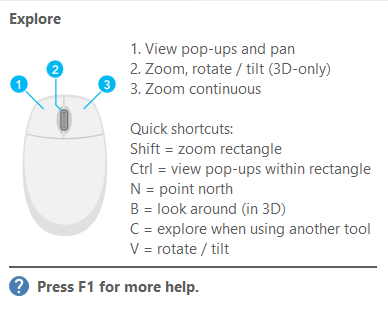
4.  The keyboard shortcuts give you additional movement options that can 
be helpful for when your mouse is engaged in a different operation.
5.  Left-click on one of the neighborhoods. A popup will open that shows you the
attribute values from the attribute table for that neighborhood, such as its
name. 
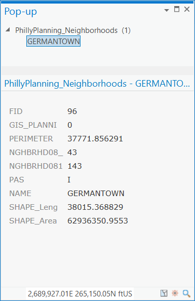
6.  To change the layer displayed in the popup, click the **Explore** drop-down button, and
a menu will appear with different popup display options. Turn on the other
map layers and click on features to display their attribute data.
7.  Note that when features are close together (e.g. a bike network
    nearby a school), the popup may display information for several nearby
    features. Zoom in until you can select a single feature.

### On-Screen Navigator

The **On-Screen Navigator** is a tool that allows you to change the camera
angle of the map display. When enabled, this tool sits in the bottom left
corner of the map view. This can be particularly useful for 3D maps,
but it can also be used to change angles for a 2D map.  

1. Click on the **View** tab on the ribbon.
2. Click on the **Navigator** button to add the **On-Screen Navigator** to your map view. 
3. Click the arrow on the top left of the navigator to turn on the **Show Full Control** mode.  Slide the inner circle arrow around to see Philadelphia from a different angle.  Then slide the arrow back to the top of the navigator.
4. Click again on the **Navigator** button to toggle off the **On-Screen 
Navigator**.

### Full Extent, Previous Extent, and Next Extent

The map extent tools allow you to navigate through map extents. A map
extent defines the geographic boundaries for displaying map layers
within a map window. 

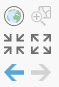

**Note:** If you have an active basemap layer on your map, the 
**Full Extent** tool will display the entirety of the basemap, which covers the 
entire world.  If you would like to show the extent of just one of your layers, such as the extent of the City of Philadelphia covered by the neighborhoods layer, you can right-click
on that layer in the **Contents** pane and select **Zoom to Layer**.

**Try the different map extent tools.**

### Measure Distances and Areas

How big is Philadelphia?

1.  Click the **Measure** button  
on the **Map** tab to open the **Distance** tool.
2.  When the measure window opens, click on the units dropdown menu (its
    down arrow), and select 'Miles'.
3.  Click on the northeastern tip of Philadelphia and then move the ruler 
tool to the southwestern tip and double-click to take the measurement. Note
that the distance between the two points is now displayed under **Distance**.
4.  Close the measure window.

## Working with Attribute Tables

Along with **feature classes** (also known as **vector** datasets, which include points, lines, and polygons) and image
datasets (referred to more generally as **raster** datasets), tables
represent one of the three key dataset types in GIS. Tables are used to
store descriptive attributes about geographic features (e.g., census
data for counties or census tracts, disease counts by health district).

### Opening the Attribute Table

1.  Turn off all layers except for schools.
2.  Right-click the schools layer in the **Contents** pane and select **Attribute Table** from the menu.  
    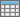

The table containing the records for schools should open below the map window. This is same table you viewed earlier in the catalog view.

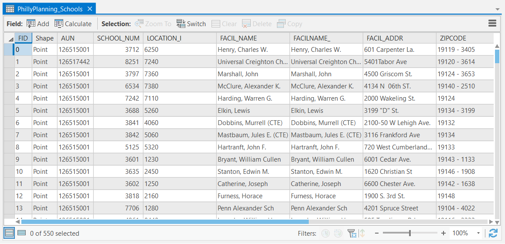

1.  The attribute fields names appear at the top. Scroll across the
    table to view them all. Some important fields are:
      - `FACIL_NAME` which contains the name of the school
      - `ENROLLMENT` which contains the number of students
      - `GRADE_LEVE` which contains the grade level of the school
      - `TYPE_SPECI` which indicates whether the school is run by the
        District (Philadelphia School District), or is a private,
        charter, or Archdiocese (Catholic parish) school.
2.  Scroll down the table to view the records. Note the total number of
    records (rows) in the layer appears at the bottom (550 schools),
    along with a count of how many are currently selected, which at the
    moment should be 0).
3.  Open the attribute table for the bike network layer. Note the
    important fields:
      - `STREETNAME` which indicates the name of the street
      - `TYPE` which indicates the type of bike lane (buffered,
        conventional, sharrow, conventional with sharrow).
4.  Open the attribute table for the neighborhood layer. Note the
    important fields:
      - `NAME` indicating the name of the neighborhood.
5.  Close all the attribute tables.

### Select by Attribute (Attribute Query)

An attribute query helps users select or view certain data on the map
based on that data’s attributes. It works the same way as a relational
database like Microsoft Access.

> **Structured Query Language (SQL)** is a set of defined expressions
> and syntax used to query and manipulate data in relational database
> management systems (RDBMS).
> 
> The American National Standards Institute (ANSI) defines a standard
> for SQL. Most RDBMSs use that standard and have extended it, making
> SQL syntax across different RDBMSs slightly different from one
> another.
> 
> Query expressions are used in ArcGIS to select a subset of features
> and table records. Query expressions in ArcGIS adhere to standard SQL
> expressions.

One way to select geographic features is directly from the attribute
table. From a table, you can manually select records with the mouse
pointer, or you could select those records that meet some criteria (SQL
query). Once you’ve selected records in the table, you’ll see those
features selected (highlighted) on your map in a bright blue color.

Manual Selection:

1.  Open the schools attribute table. Right click on the `FACIL_NAME`
    field and select **Sort Ascending**. This puts the schools in
    alphabetical order by name.
2.  Scroll down the table until you find the 'Dunbar, Paul Laurence'
    school.
3.  Click on the row on the far left of the table to manually select
    that row (see circle in the picture below). Note the Dunbar school
    will be highlighted to show its selection – in both the attribute
    table and in the map (it is adjacent to Temple University Main
    Campus). Note that at bottom of the table it should indicate 1 out
    of 550 schools are selected.  
    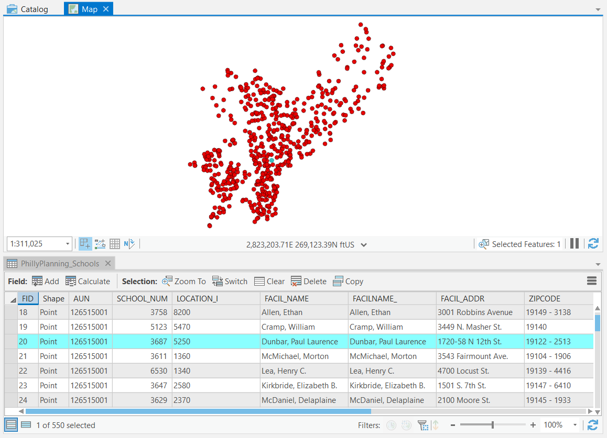 
4.  Clear the selection by clicking the **Clear** button
     on the attribute table or
    on the **Map** tab.
    

Attribute Query:

1.  With the attribute table open and active, click on the contextual **View** tab on the ribbon and 
click the **Select by Attributes** button.
    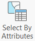
2.  The **Select Layer by Attribute** pane will open up that allows you to make
a query statement. We will create a query that states which schools will be selected based on some criteria, in this example, the school with the name 'Dunbar, Paul Laurence'.
3.  In the **Select Layer by Attributes** Geoprocessing pane, make sure that **Input Rows** is set
to the schools layer, and that **Selection type** is set to 'New Selection'. 
4.  Click the **New Expression** button. This will launch the query builder. 
5.  The `WHERE` keyword indicates that a criteria is about to specified. 
The database engine will use this
    criteria to *filter* the records, that is, to select only those
    records which satisfy the criteria. This notation is part of a standard 
    SQL query.
6.  In the first box, click the arrow next to `FID`. This will give you a drop
down list of all the attributes of the schools layer you can use to filter your selection. Click `FACIL_NAME`.
7.  In the next box, click the text. This will give you a drop-down list of 
all the ways you can relate your filter criteria to the `FACIL_NAME` attribute. 
Click 'is equal to' to keep the default association.
8.  Click inside the last box.  This will give you a drop-down list of all the
unique values found in the `FACIL_NAME` column of the schools layer. Scroll down in the list of school names and double-click
    'Dunbar, Paul Laurence'.
9.  Click `Apply` to select the matching features. The same school should be selected in the table and on the map.
10.  Clear your selection and close the Geoprocessing pane.
11.  As another example, let’s select schools with enrollments over 500
    students. Open **Select by Attributes** for the schools layer and click the **New Expression** button.
12.  Create a query statement by choosing `ENROLLMENT` field
    in the first box, and 'is greater than' in the second box. Click in the last box and type in 500. Click Run.
13. The selection should show that 212 out of 550 schools have
    enrollments over 500.
14. You can also create a compound query.  With the last query still specified, 
click **Add Clause**.  Select 'And' in the first box, `TYPE_SPECI` in the second box, 'is equal to' in the third box, and 'District' in the last box. Click Run. This will select
    only schools run by the Philadelphia School District (as opposed to
    charter, private, or Archdiocese schools) with enrollments greater
    than 600 students. There should be 129 schools selected.
15. Close the **Select Layer by Attributes** pane, clear your selection, and    close
    the attribute table.    

### Getting Statistics for Selected Records

When exploring a table, you can immediately get statistics describing
the numeric values in the columns. When you use the statistics tool
you’ll see how many values the column has, as well as the sum,
minimum, mean, maximum, and standard deviation of those values. A
histogram is also provided showing how the column’s values are
distributed.

As an example, we will get statistics from the schools attribute table:

1.  Clear all your selections so no schools are selected. Open the
    schools attribute table.
2.  Right-click the heading of the field `ENROLLMENT` and select
    **Statistics**.
3.  On the **Statistics** mode of the Chart Properties pane, you’ll see information about the
    values in the field whose heading you clicked.  
    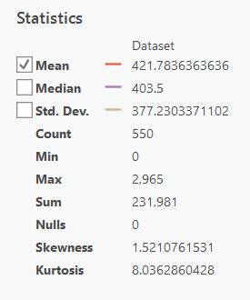 
4.  Note the statistics, e.g. minimum, maximum, mean, etc. The sum is
    the sum of the row values in the `ENROLLMENT` field for all the
    schools, i.e. the total number of students in all schools – 231,981
    students.
5.  The **Statistics** tool will also generate a histogram in the table area
    that shows the distribution of the values in the `ENROLLMENT` field.
    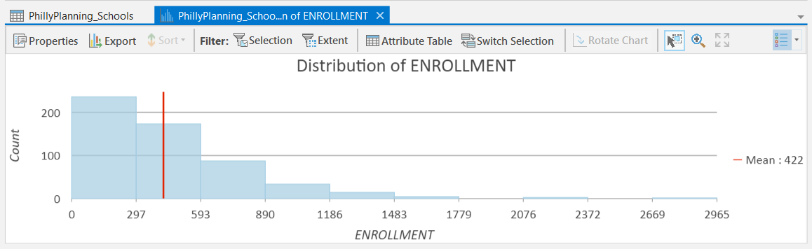
6.  In the table area, switch back to the schools layer attribute table.
    Using **Select by Attributes**, select only the private schools. There 
    should be 173 schools selected.
7.  Reopen the statistics for the `ENROLLMENT` field. Note that there is now
    a column in the side pane for the **Selection** as well as the entire **Dataset**.  We 
    can compare the summary statistics for the entire schools layer to our
    selection of private schools.
    
8.  Note that the new histogram now contains an overlay of a separate
    histogram for just our selected features.  We can change the histogram
    display to show only the selected features by toggling on or off the
    **Filter: Selection** button in the histogram toolbar.
     

## Graphical Selection

You can also select features interactively on the map.

The **Map** tab contains a tool for graphically selecting
features. The **Select Features** tool works using a single graphic that
you interactively digitize (draw) as part of the selection process.

1.  Click the **Select** drop-down menu, 
    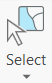, then click **Rectangle**  
    
2.  Using the cursor draw a rectangle around a set of schools, say, the
    schools in West Philadelphia.  
    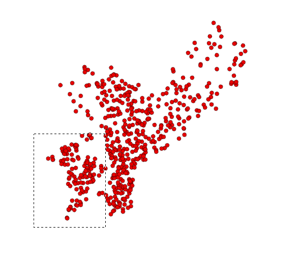 
3.  Examine the selected records on the map and in the schools attribute
    table.
4.  You can also perform a graphical selection using a circle or other
    shapes. Experiment with different graphical selection options.
5.  When you are finished, clear your selection.

## Select by Location (Spatial Selection)

You can also select features based on their spatial relationship to
another feature, such as the distance between features or whether one
feature contains another feature. As an example we will select schools
located within 500 feet of the bike network.

1.  Turn on the schools and bike network layers (neighborhoods should be
    off).
2.  On the **Map** tab, choose **Select by Location**.  
    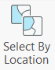
3.  On the **Select Layer By Location** pane, set the following parameters:
      - **Input Features:** PhillyPlanning\_Schools (since you want to
        select schools)
      - **Relationship:** Within a Distance
      - **Selecting Features:** PhillyStreets\_Bike\_Network
      - **Search Distance:** 250 Feet  
      - **Selection Type:** New Selection
      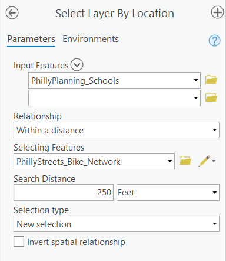
4.  Press Run.
5.  You should see 140 of the 550 schools selected. Open the attribute
    table for the schools layer to see how many schools are selected.
6.  Clear your selection so no schools are selected.

## Using Selected Features in Another Selection Operation

You can also select features from a set of features which are already
selected, or alternatively, select a set of features from a set of
selected input features. We’ll use two examples for illustration.

First, we will select features from a set of features which are already
selected – charter schools (first selection) and enrollments over 1,000
students (second selection).

1.  Turn on only the schools and neighborhoods layers (turn off the bike
    network layer). Put the neighborhoods layer on the bottom of the
    drawing list so you can see both schools and neighborhoods layers
    clearly.

2.  Using **Select by Attributes**, select only the charter schools. There
    should be 94 selected.

3.  In the same **Select Layer by Attributes** pane, change the **Selection type**
    to 'Select subset from the current selection'. Then, change the
    query expression to select those schools with enrollments greater than
    1,000.  Click Run.  There should be 15 schools selected, which are both 
    charter schools and with enrollments greater than 1,000 students.
    
    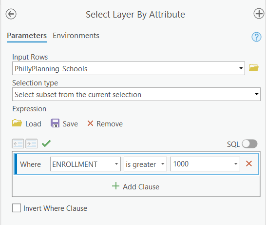

Now, we will select a set of features from a set of selected source
features – the neighborhoods that contain the selected schools.

1.  Close the schools attribute table, but keep the 15 charter schools
    selected.  
    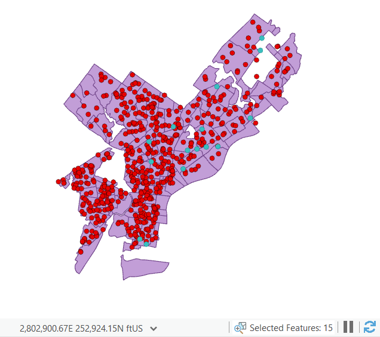
2.  Open **Select By Location**.
      - For **Input Features** choose the neighborhoods layer.
      - For **Relationship** choose Contains. This spatial
        relationship operator allows you to select based on spatial
        containment – whether on feature contains another feature –
        i.e. if a neighborhood contains a currently selected school.
      - For **Selecting Features** choose the schools layer. Since there is
        an active selection in this layer already, this spatial relationship
        will apply only to the selected schools.
        (Make sure the **Search Distance** box is blank)
      - Press Run.
      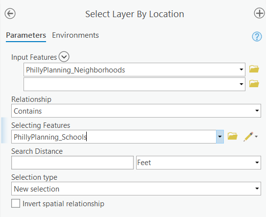

There should be 10 out of 48 neighborhoods selected.

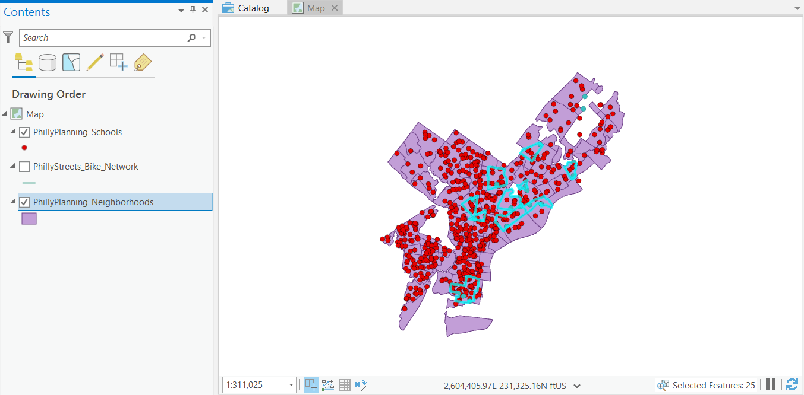

## Creating a New Map Layer from a Selection of Features

Frequently, you will want to save your selected subset of features as a
separate, standalone data file. For instance, you may want to select a
set of schools based some enrollment criteria, and save this smaller
number of schools as its own data file, not simply as a selection within
the original schools data file. Generally, as you proceed through a GIS
analysis, it is helpful to regularly save your selected features in
separate data file.

You will have occasion to create new data files over and over again this
term, and you must pay attention to where you are storing this data
*every single time*. ArcGIS tries very hard to get you to save your
data:

1.  in the **Geodatabase** format; and
2.  in a default location on your local hard drive.

Additionally, it sometimes gives you unhelpful default file names.

Therefore, if you don’t pay attention when you do this step, you will
end up with a file name that is unintelligible, in a format that you
don’t want, in a location that you won’t be able to find. Do not do
this.

As an example of how to save a selected set of data to its own file, we
will export the 10 selected neighborhoods from the last step in the
tutorial.

1.  Make sure the neighborhoods layer is on and you have 10
    neighborhoods selected.
2.  In the **Contents** pane, right-click on the neighborhoods layer, then choose **Data → Export Features**.
3.  For **Input Features**, choose the neighborhoods layer (this should 
    already be chosen).
4.  For the **Output Location**, choose your Lab1 folder.  **Note:** you will
    need to navigate to the parent folder of Lab1 in order select the Lab1
    folder as the Output Location.
5.  For **Output Feature Class**, enter my\_neighborhoods (or, whatever you want to name this file – whether or not you leave .shp at the end doesn’t matter).  
6.  Click Run. The new layer will the 10 previously selected neighborhoods
    will automatically be added to the **Contents** pane and to the map.
7.  Clear your selection so no schools or neighborhoods are selected.
8.  Turn off the neighborhoods layer. You should be able to see the
    my\_neighborhoods layer contains only those 10 previously selected
    neighborhoods.

## Designing and Exporting a Map

In this section we will see how to create a map layout and export the
map.

### Working in the Layout View

We have been working with our maps in a map view, which is most useful
for data exploration and analysis. When producing maps for export, we
need to create a **layout**. In this type of view, you will see a 
representation of a page, and the map (or maps) will appear on that
page. In a layout you can also add other elements, such as
titles, textboxes, and legends. It is possible to place elements 'off'
the page (in an area known as the 'pasteboard' in desktop publishing
lingo). Anything not on the page will not be included on the map when
you export the image, so it can be a useful place to store items during
the design process when you are trying out different ideas.

1.  Turn off the bike network layer and the basemap layers and turn on all the other layers.
    Put them in the following drawing order:
      - Schools (top)
      - My\_neighborhoods
      - Neighborhoods (bottom)
2.  Make sure you are viewing the full extent of your data (press the
    full extent button to be sure). Your canvas should look something
    like this (your colors may be different):  
    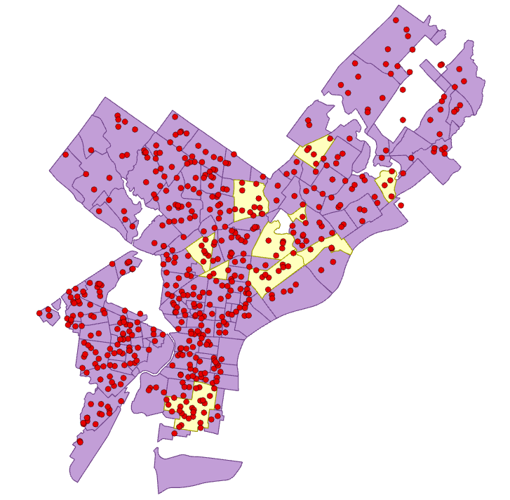
3.  Add a layout by clicking the **New Layout** button on the **Insert** tab.  
    A popup menu will prompt you to choose a 
    page size for your document.  Choose the first option under the 
    **ANSI - Portrait** section: Letter, 8.5 x 11". 
    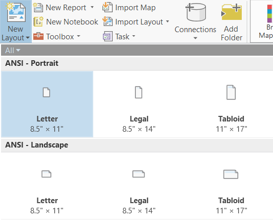
    
    
    On the **Insert** tab, click on **Map Frame** and select the current
    extent option for your map. This will insert the map as it is currently
    visible in the open map view.
    
4.  A blank layout will appear in a new tab. To insert
    a map frame that will contain your current map, click on the **Insert**
    tab, then click on the **Map Frame** button.  In the drop-down, under
    **Map**, select the current extent option for your map. Then click and drag a rectangle on your blank layout to insert the map frame.
    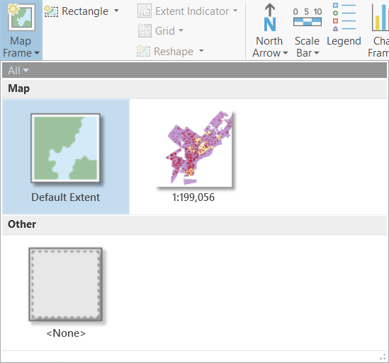
5.  Notice that a new **Layout** tab has appeared on the ribbon where the 
    **Map** tab was previously located. This tab has a **Navigate** tool,
    similar to the **Explore** tool on the **Map** tab, and other familiar 
    navigation tools. These tools will zoom into the page (not the map).
    Notice that each of these icons has a page behind it (e.g. 
    magnifier on a page) to distinguish it from the navigation tools in
    the Map tab. Experiment with these tools to move around the page.
    When you are done, hit **Full Extent** to see the entire layout.
    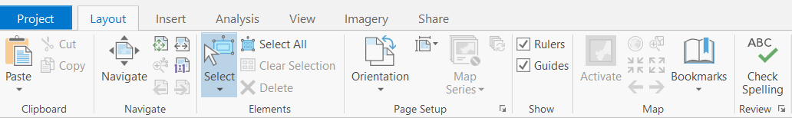
6.  To resize the map image on the page, you will need to 'activate' the 
    map frame. On the **Layout** tab, click the **Activate** button. 
    ![] (images/activate.png)
7.  The **Map** tab will reappear and you will be able to navigate using the
    Explore tools that you used in the map tool. Zoom in on the map to
    make sure that Philadelphia fills most of the map frame. Note that if
    you zoom in too far, parts of Philadelphia will be 'outside' the map
    frame, and will not appear on the page. When you are done with the
    activated map frame, click on the highlighted **Layout** tab, and click 
    the **Close Activation** button. The **Layout** tab will reappear in place
    of the **Map** tab.
    ![] (images/close_activation.png)
8.  Use the **Insert** tab to add the following elements by clicking first on
    the tab buttons and then double-clicking on the map where you want the
    element to display:
    1.  **Title—Click Rectangle->Text** and either double-click on the map to
    insert the default size or drag a box of the size that you want.
    2.  **Legend**—A default legend will appear, and can be edited later.
    3.  **North Arrow**-choose any of the options from the drop-down menu.
    4.  **Scale Bar**-choose any of the options from the drop-down menu.
    
9.  Reposition the map elements to fill the white space. Try not to have
    any elements overlaying the Philadelphia neighborhoods. Your final
    layout may look something like this, but do *NOT* try to make it
    look exactly the same. Just make sure it has all of the requested
    elements:  
    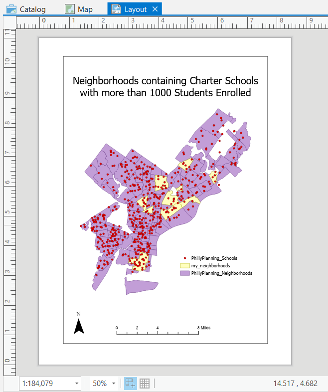

Once you have completed your map, save your .aprx project file.

## Exporting a Map Image

A finished map product can be exported into an image file that can be
inserted into a MS Word document for your lab reports, or into web pages
or other documents.

Here, as an example we will export the map using two different image
formats, PNG and JPEG.

1.  Click on the **Share** tab and click the **Layout** (Export Layout) button.
2.  Set the **File Type** to 'PNG'.
3.  Navigate to your Lab1 folder and specify a name for your image. As
    always, be clear about where you are saving your files.
4   Press Export.
5.  With the **Export** pane still open, change the **File type** to 
    'JPEG'.
6.  Confirm that you are still in the Lab1 folder.
7   Press Export.

# ASSIGNMENT

## Objective

Consider that the Philadelphia School District is interested in
encouraging its students to bike to school. The district wants to know
what neighborhoods contain its largest schools that are well-connected
to the bike network. To address this, answer the following question:

What neighborhoods contain Philadelphia School District schools that
both enroll more than 1,200 students and are also within 0.1 mile of the
bike network?

## Deliverables

**Turn in a report in the format described in the syllabus.**

Be sure to include the following information:

1.  A list of the Philadelphia School District schools that both enroll
    more than 1,200 students and are within 0.1 mile of the bike network
    (*hint…there are 5 schools that meet these two criteria*).
2.  The total enrollment of those 5 schools,
3.  A list of the neighborhoods that contain those 5 schools
    (*hint…there are 4 neighborhoods*).
4.  A map showing the 5 schools and the 4 neighborhoods that meet the
    criteria, overlain on a map of all the neighborhoods and schools.

The **Introduction** section should state the research objective and the
relevant criteria for selecting the neighborhoods and schools.

The **Data and Methods** section should state the data sets used in the
analysis, from where those data were acquired, and the GIS operations
employed.

The **Results** section should state the results (i.e. the neighborhoods
that meet the criteria, as well as the four pieces of information listed
directly above). The final map should be cited in the text here
(e.g. Figure 1).

The **Discussion** section should state an interpretation of the results
(i.e. do these neighborhoods tend to concentrate in certain regions of
Philadelphia, how can this information be used to improve bike network
access for students, etc.), limitations of the analysis, and how the
analysis could be improved or expanded.

The **Tables and Figures** section should contain the map of the
selected schools and neighborhoods noted above, with a caption. The map
should be cited in the text.

## Getting Started

All the data and operations you need to complete this assignment are
described in the tutorial above.

There are many ways to complete this analysis. A simple way is to parse
the analytical objective into a smaller set of operations that proceeds
in steps:

1.  Select the schools that are Philadelphia School District schools and
    that enroll more than 1,200 students (use a **Select by Attributes**
    operation).
2.  Of those selected schools, select those that are also within 0.1
    miles of a bike network (use a **Select by Location** operation).
3.  Export the 5 selected schools to its own shapefile.
4.  Select the neighborhoods that contain those 5 selected schools (use
    a **Select by Location** operation)
5.  Export the 4 selected neighborhoods to its own shapefile.
6.  Create a map layout that overlays the 5 selected schools
    and 4 selected neighborhoods on top of the schools and neighborhoods
    for all of Philadelphia, using color settings that distinguish the
    schools and neighborhoods that meet the selection criteria.
