**Learning Objective**

To introduce the principles and techniques of thematic mapping,
including dot density, proportional symbol, and choropleth mapping, as
well as data classification and basic map design. As a demonstration,
you will acquire and map spatial data from the 2010 U.S. Census.

First, complete the tutorial by following the steps below. Then, using
the skills you’ve learned in the tutorial, complete the assignment given
following the tutorial.

# TUTORIAL

## Acquire State Population Data from the U.S. Census Bureau

1.  In a web browser, navigate to
    <https://www2.census.gov/geo/tiger/TIGER2010DP1/>.
2.  Scroll down and click on 'State\_2010Census\_DP1.zip' to download.
3.  Copy the downloaded zip file into your workspace and unzip it.

Create a new project in ArcGIS Pro and view the spatial and attribute data for the State\_2010Census\_DP1 shapefile in the catalog view.

## Convert the Shapefile to NAD 1983 Contiguous USA Albers

While in the catalog view, search for the **Project** tool and use it to convert 
the state data you just acquired to a new shapefile that is in the `NAD 1983 Contiguous USA Albers` projected coordinate system. 

Call the new shapefile 'State\_2010Census\_DP1\_Albers' (you can search
for this CRS in the search text box). Be sure to send the new shapefile
to your workspace.

## Select and Export the 48 Contiguous United States

1.  Insert a new map, remove the basemap layers and add the State\_2010Census\_DP1\_Albers shapefile.
2.  In the map, select all the objects in the shapefile except the
    following: Alaska. Hawaii, Puerto Rico, the District of Columbia.
    You can do this by opening the attribute table and performing a
    **Select by Attributes** operation, through graphical selection, through
    manual selection, or by some combination. The **Switch Selection**
    button 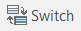, which
    reverses the selected and unselected records, may also be useful. 
    **Note:** Once you have several records selected in the attribute table
    or in the map, you can de-select records by pressing and holding Ctrl 
    and clicking on the records you wish to de-select.
      - There should be 48 states (rows) selected.
3.  Export the 48 selected states to a new shapefile by right clicking
    on the name of the shapefile in the **Contents** pane, going to **Data**,
    and then **Export Features** to open the **Feature Class to Feature Class** Geoprocessing pane.
      - For **Input Features** make sure that State_2010Census_DP1_Albers is chosen.
      - For **Output Location** choose the workspace folder for Lab 3. 
      - For **Output Feature Class** call the new shapefile 'Contiguous\_States.shp'
4.  The new Contiguous\_States shapefile should be added to the map once the    export is complete. Remove the State\_2010Census\_DP1\_Albers shapefile.
5.  Zoom to the Full Extent.

## Explore the Attribute Table

In the map view, open the Contiguous\_States attribute table and review the
field names.

  - The `GEOID` field is a unique numeric code for each state used by
    the U.S. Census Bureau.
  - The `STUSPS10` field is the two letter U.S. Postal Service code for
    the state.
  - The `NAME10` field is the name of the state.
  - The `ALAND10` field is the land area of the state in square meters.

Note that most field names use a code composed of a set of letters and
numbers, e.g. `DP0010001`.

In Microsoft Excel (not ArcGIS), open the Excel file 'DP\_Table
Descriptions.xls', which should be located in the same folder as your original shapefile. Here you will see the definition of each of the field
names in the Contiguous\_States attribute table.

The fields contain measures of the population of each state, including
the total population, and population counts broken down by age, sex,
race, Hispanic ethnicity, and household characteristics (e.g. types of
families, renters versus home-owners, etc.)

Note two other important fields we will use in the lab assignment:

  - The `DP0010001` field is the total population of each state.
  - The `DP0100002` field is the Hispanic population of each state.

Return to the Contiguous\_States attribute table in ArcGIS.

It is often useful to *sort* the table based on a field’s values, say,
from highest to lowest.

As an example, you will sort the table based on the total population,
where states with the highest population will be at the top and those
with the lowest at the bottom.

To do this, right click on the total population field (`DP0010001`) and
choose **Sort Descending**.

Note the table is now in the order of states from the highest population
(California - 37,253,956 people) to the lowest (Wyoming - 563,626
people).

By repeating this step, this time selecting **Sort Ascending**, you will
see Wyoming is now at the top and states are ranked from smallest to
largest with respect to population.

## Make an Area-Class Map of the States

1.  In the **Contents** pane of the map view, right click on the
    Contiguous\_States shapefile and choose **Symbology**. 
2.  The **Symbology** pane will open on the right side of the window. Click on the **Primary Symbology** tab if it is not already active. Here, we
    will assign a unique color to each state.
3.  Change the symbology type to **Unique Values**, under **Symbolize your layer by category**.
4.  For **Field 1** choose `STUSPS10`. Your map window will automatically
    reflect the new symbology.

You should see a map that looks something like this:

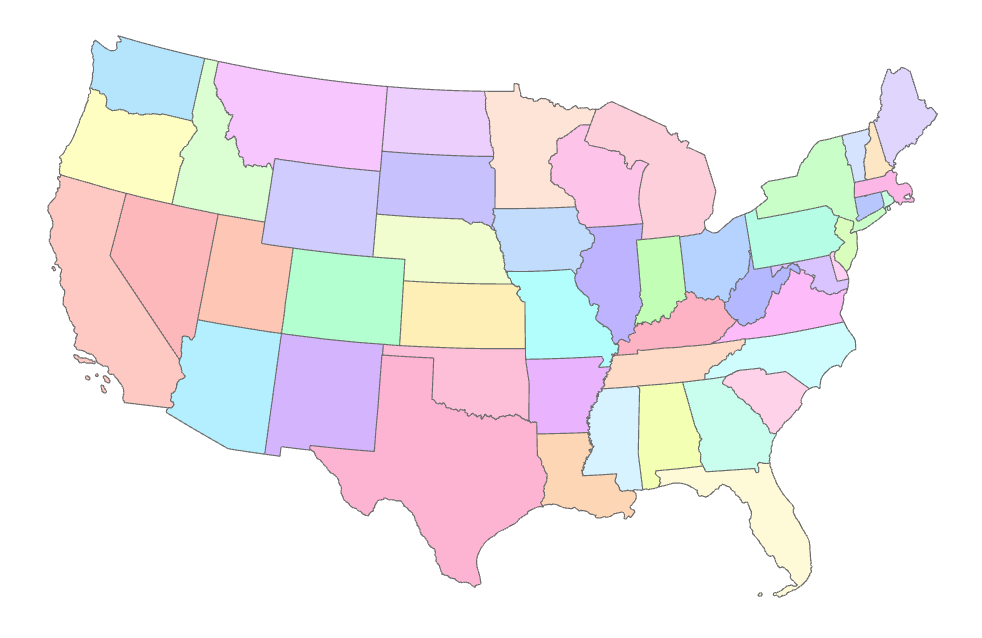 

## Add State Name Labels

Now, we will set our preferences to label each state with its
appropriate two letter code.

1.  Click on the Contiguous\_States layer in the **Contents** pane, then click on the contextual **Labeling** tab on the ribbon.
2.  In the **Label Class** group, for **Field**: choose `STUSPS10`.

Now, we will display the state code labels.

3.  Click the **Label** button to turn on labeling for the states layer.
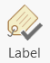 

Labels of the state code (e.g. PA for Pennsylvania) should appear on
each state.

## Make a Proportional Symbol Map of Total Population

1.  Turn off the **Label Features** option so the labels do not appear, by
    right-clicking on the Contiguous\_States shapefile in the Contents pane and clicking **Label** to toggle the labels off.
2.  Open the symbology for the states layer.
3.  Change the symbology type to **Proportional Symbols**, under **Symbolize your layer by quantity**.
4.  For **Field**: choose the field that contains the total
    population - `DP0010001`. 

You should see a map that looks something like this:

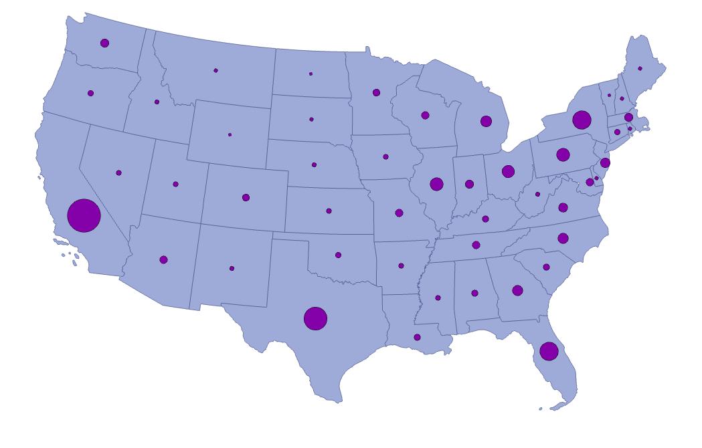 

On the **Symbology** pane, clicking on the glyph next to **Template** allows
you to customize the proportional symbol.  You can also customize the background of your polygons by clicking on the box next to **Background**.
Additionally, you can adjust the minimum and maximum size of your point symbols so that they are visible, yet completely contained within the polygons they represent.

Experiment with different background colors, symbol colors, and
symbolization to change the look of the map. Cartographers recommend
sizing the symbols so that they overlap slightly in the densest part of
the map (which for maps of the continental U.S. will usually be the high
population density Northeastern states).

## Make a Dot Density Map of Total Population

1.  Open the symbology for the states layer if it is not already open.
2.  Change the symbology type to **Dot Density**, under **Symbolize your layer by quantity**.
3.  In the first selection box under **Fields**, choose the field that        contains the total population.

You should see a map that looks something like this:

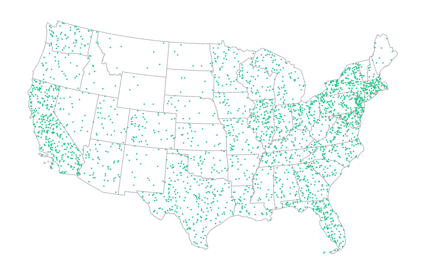 

Note the dots may be faint depending on the color scheme you’ve chosen
(or defaulted).

On the **Symbology** pane, clicking on the glyph next to your field name
allows you to customize the dot symbol. You can also customize the background of your dots by clicking on the box next to **Background**. Additionally, you can change the dot size and value in the options in the middle of the pane.

Experiment with different background, size, value, and color
symbolizations to change the look of the map. Make sure the least
populous states have two to three dots, and that the dots coalesce in,
but don’t completely cover, the most populous states.

## Make a Choropleth Map of Population Density

1.  Open the symbology for the states layer if it is not already open.
2.  Change the symbology type to **Graduated Colors**, under **Symbolize your layer by quantity**.
3.  For **Field**: choose the field that contains the total
    population.

Here, we will map the population density - the total population divided
(or 'normalized') by the land area of each state. The population density
yields a measure of people per unit area (e.g. people per square mile).
Thus, population density shows the concentration of population,
accounting for the fact that given two states with the same total
population, if one is much larger in area than the other, the population
will be more sparsely distributed on average.

4.  To map population density, place total population (`DP0010001`),
    under **Field**. Under **Normalization** choose the field that contains
    the land area of each state - `ALAND10`. This will map the value of
    each state’s total population divided by its land area (in square
    meters). The units you see in the map are therefore people per
    square meter.
5.  For **Method**, choose **Quantile**. 

A **Quantile** classification keeps approximately the same number of records
(states) in each class regardless of the range of the attribute values.

The bottom box of the pane shows the classes generated by this method
and the symbols, values, and labels of each one.

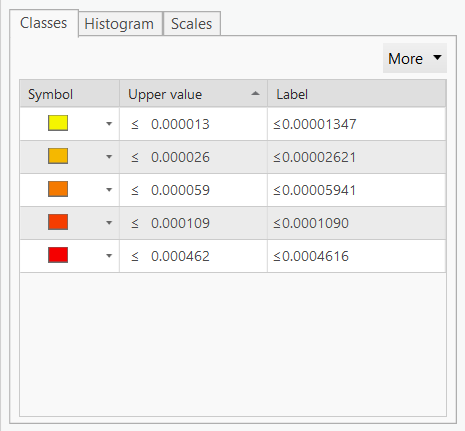 

The **Histogram** tab of this box shows you a histogram of population density values.

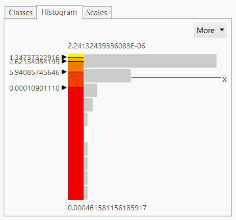

Break values for the different classes are reported as black lines in the
histogram and in text on the left side of the box. These are
generated automatically by the classification method you choose (here,
**Quantile**).

You can also change these manually by dragging the black lines or 
entering numbers as text in the **Upper value** boxes of the **Classes** tab
(though this would change the classification scheme from **Quantile** to 
**Manual**).

6.  You can also choose a different color ramp under **Color Scheme**.
    Choose a blue sequential color scheme.

You should see a map that looks something like this:

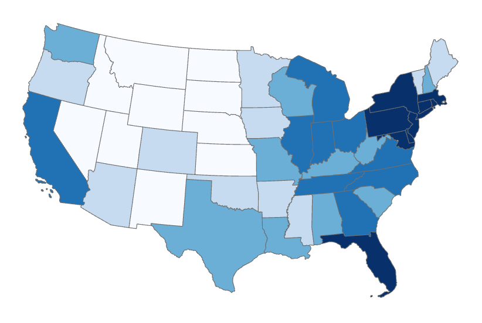 

On the **Symbology** pane, experiment with the equal interval
and natural breaks data classifications. Note that the classification
schemes can represent the underlying data in dramatically different
ways.

Experiment with creating your own data classification by manually
changing the class break values by grabbing and moving the black lines
shown on the histogram.

For each data classification you choose, note the differences in the
class breaks as expressed on the histogram and consequently the changes 
in the map.

You can also experiment with different color ramp options. Note,
however, that only sequential or diverging color schemes are appropriate
for continuous data such as population density.

## Design a Map Layout

Once you have created a map of population density with an appropriate
data classification and color scheme, you can design a map layout and
add other essential elements such as a legend, scale bar, etc.

1.  Insert a new layout with a landscape orientation.
2.  On that new layout, insert a map frame.
3.  Insert a legend onto the map frame by clicking the **Legend** button on the **Insert** tab, then double-clicking on the map frame to place the legend.

Note that the legend is a graphic object that can be grabbed and moved,
changed in size, etc., as is the map frame in the layout.

It is also related to the legend in the **Contents** pane. If you change
the symbolization in the map view, the legend will automatically adapt.

For instance, let’s change the number of displayed significant digits in
the population density to make them easier to read.

4.  Open the symbology for the states layer and click on the **Advanced 
    symbol options** tab. Expand the **Format labels** section.
    
5.  Under **Rounding**, change the number of decimal places to 5.

Notice the change in the both the **Contents** pane and the legend.

In order to format the legend properly, it is often easier to break it
into smaller graphic pieces. **Note, however, that this also breaks the
relation to the legend in the Contents pane. If you change the layer
properties and want the legend to reflect the new symbolization, you
will have to delete the graphics-converted legend and add a new legend
based on the layer.**

6.  Select the legend in the layout, right click on it, and choose
    **Convert to Graphics**.  
    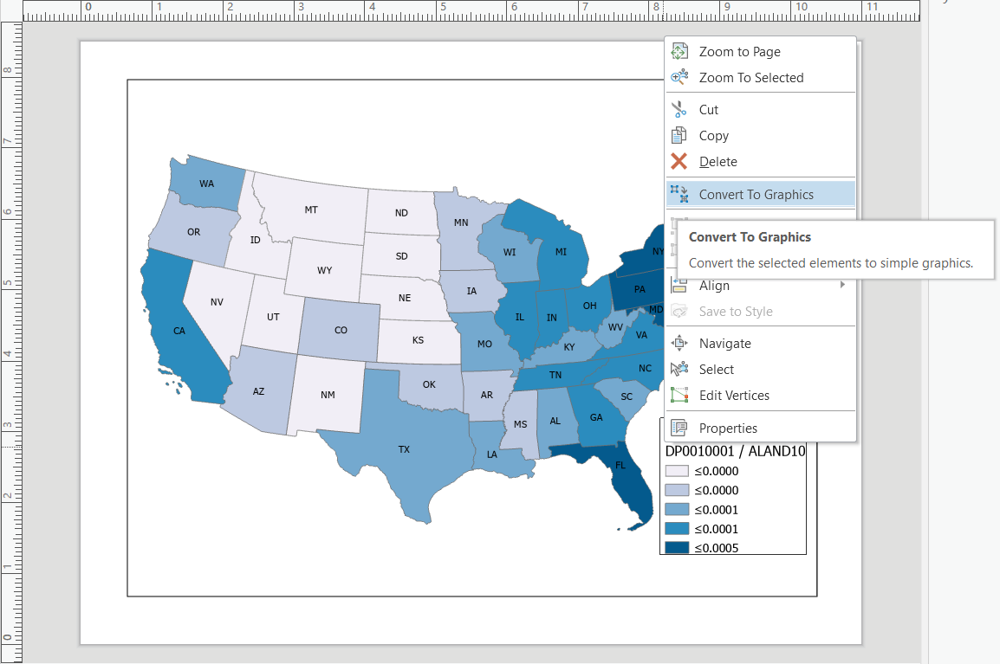 
7.  Then, right click on the legend again and choose **Ungroup**. This
    will break the graphic into its graphic and text components.

Double-clicking on a text object allows you to edit the text. Double-clicking on a graphic object allows you to edit the color and size of
the object.

Alter the legend so it appears something like this:

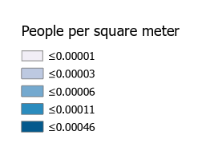 

8. Insert a scale bar by going to the **Insert** tab and choosing
    **Scale Bar**.
    
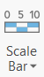 

9. Clicking on the button will choose the default scale bar, or you can
pick from other options by clicking the down arrow to open the menu.
10. Once the scale bar is chosen, click on the map where you would like
to place it.

The scale bar is related to the zoom of the map frame, so if you activate
the map and change the scale of your map (i.e. zoom in or out), the scale
bar will also change automatically.

11. Grab and change the size of the scale bar so that it has a round
    number (e.g. 1000 miles across).
12. Insert a North Arrow by going to the **Insert** tab and choosing
    **North Arrow**. Like the scale bar, clicking on the graphic button
    will select the default North Arrow, but you can click the down arrow
    for more options.
13. Click anywhere in the layout to place the North Arrow you have chosen.

You can also insert a title by going to the **Insert** tab and
choosing a text option from the Text group. The default option is **Rectangle**, which creates a text box that can be resized to fit more text
but will retain the same font size. The **Text** option creates point text
that will change size when the object is resized. Either can work for a 
title, but the point text may be easier to manipulate.

Drawing tools to insert shapes and other graphic objects are available
in the **Graphics** section of the **Insert** tab. These behave similarly to graphics handling in many other software packages, such as MS Word.

Arrange the legend, scale bar, and North Arrow aesthetically and
efficiently on the map. A simple and reasonable layout could look
something like this:

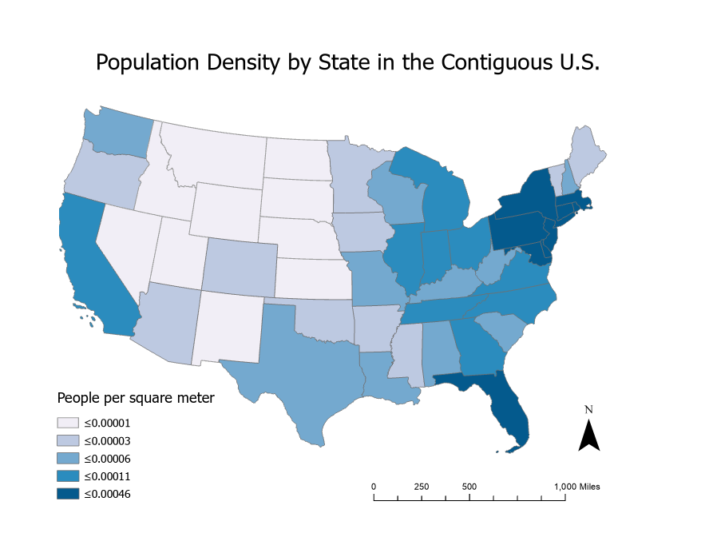 

You can export your map as an image file so that it can be inserted in
other documents, such as a MS Word document or MS Powerpoint
presentation or posted to a website.

To export your map go to the **Share** tab and choose **Layout**.

In the **Export Layout** pane you can give the image file a path and file
name and choose a format. A common image format is .png, though .jpg, .eps,
and other formats are available. A .png resolution of 300 dpi is
advisable for use in your lab reports for this course.

# ASSIGNMENT

## Objective

Describe the spatial distribution of the Hispanic population in the
contiguous U.S. by state, according to the 2010 U.S. Census.

## Deliverables

**Turn in a report in the format described in the syllabus.**

Be sure to include the following information:

1.  The five states that have the highest number of Hispanics, and the
    Hispanic population of each.
2.  The five states that have the lowest number of Hispanics, and the
    Hispanic population of each.
3.  The states whose Hispanic population is greater than the total
    population of the least populous state in the U.S.
4.  A proportional symbol map or a dot density map that shows the
    distribution of the number of Hispanics in each state.
5.  A choropleth map, using a sensible data classification of your
    choice, that shows the percentage of Hispanics in each state.

The **Introduction** section should state the research objective.

The **Data and Methods** section should state the data sets used in the
analysis, from where those data were acquired, the GIS operations
employed, and the mapping techniques employed (i.e. state and justify
why you chose specific mapping options, such as the type of map, color
scheme, the particular data classification for your choropleth map, and
so on).

The **Results** section should state the results, i.e. a description of
the spatial distribution of Hispanics in the U.S. – where in the U.S. do
Hispanics tend to concentrate and where are there few Hispanics? Be sure
to include the five pieces of information listed directly above. The two
maps should be cited in the text here (e.g. Figure 1, Figure 2).

The **Discussion** section should interpret your results by briefly
interpreting why Hispanics may be concentrated in particular states and
regions of the U.S. State the limitations of the analysis (e.g. looking
at the state level may not reveal within-state variation in Hispanic
population), and how this analysis might be improved (e.g. by examining
county level data).

The **Figures and Tables** section should contain the proportional
symbol/dot density and choropleth maps, each on a separate page and with
a caption. The maps should be cited in the text.

## Getting Started

All the data and operations you need to complete this assignment are
described above.

You will need to identify the field in the attribute table that contains
the Hispanic population (it is noted above in this lab document). The
field names can be confusing – be sure to carefully select the correct
field\!

You can use the **Sort Descending** option in the attribute table to
identify the states with the highest and lowest Hispanic population.

To create a choropleth map of the percent Hispanic population for each
state, you can use the **Normalization** option in the layer symbology
to map the Hispanic Population / Total Population (which yields the
percent of the total population that is Hispanic in each state).
