**Learning Objective**

To introduce the basics of georeferencing and digitizing in ArcGIS. As a
demonstration, you will georeference historical maps and compare the
data to more recent spatial data for areas in Massachusetts and Utah.

First, complete the tutorial by following the steps below. Then, using
the skills you've learned in the tutorial, complete the assignment given
following the tutorial.

# TUTORIAL

## Acquiring the Data

The data for this tutorial includes an historical map image provided to
you:

  - [Worcester\_towns.jpg](https://github.com/temple-geography/fundamentals-of-gis/raw/master/data/Worcester_towns.jpg)
    is a JPEG image of an 1871 map of towns in Worcester County,
    Massachusetts, downloaded from DavidRumsey.com. [Click for more
    information about this
    image.](https://www.davidrumsey.com/luna/servlet/detail/RUMSEY~8~1~26368~1100042:Worcester-County-?sort=Pub_List_No_InitialSort%2CPub_Date%2CPub_List_No%2CSeries_No&qvq=q:towns%2Bin%2Bmassachusetts;sort:Pub_List_No_InitialSort%2CPub_Date%2CPub_List_No%2CSeries_No;lc:RUMSEY~8~1&mi=29&trs=294)

In addition, you are to download two GIS layers from MassGIS,
Massachusetts' spatial data repository. The two Massuchusetts GIS layers
we are interested in – towns and ponds – are in ZIP archives (linked
below) which contain other layers. Download and unzip the archives, but
keep in mind that we won't be using all of the data downloaded, and make
sure to add the correct layer when directed to.

  - `TOWNSSURVEY_POLY.shp`: A shapefile of the 2020 town boundaries in
    Massachusetts. It is included in the [Community Boundaries
    (Towns)](https://docs.digital.mass.gov/dataset/massgis-data-community-boundaries-towns-survey-points)
    
    http://download.massgis.digital.mass.gov/shapefiles/state/townssurvey_shp.zip
    bundle.
  - `MAJPOND_POLY.shp`: A shapefile from 2019 of major ponds in Massachusetts. It
    is included in the [Major Ponds and Major
    Streams](http://www.mass.gov/anf/research-and-tech/it-serv-and-support/application-serv/office-of-geographic-information-massgis/datalayers/majhd.html)
    bundle.

Move all files to your workspace folder and unzip any zip files.

## Georeferencing

**Georeferencing** is the process of aligning data with real-world
coordinates. In this tutorial we will geoference an historical map of
towns in Massachusetts to a modern GIS layer of town boundaries, and we
will **digitize** the historic lakes in the Town of Auburn and compare them to a
current shapefile of lakes. This process will take a few steps.

1.  In File Explorer, navigate to the `Worcester_towns.jpg` and open it
    in an image viewer or web browser. Note the image shows a map of
    towns in Massachusetts in 1871. Close the image.
2.  Create a new project in ArcGIS Pro and explore the `TOWNSSURVEY_POLY` and
    `MAJPOND_POLY` layers in the catalog view.
3.  Add a new map to your project. Add `TOWNSSURVEY_POLY.shp` to the map canvas. Remove the basemap layers.
4.  Set the polygon fill color to 'No Color',
    so that you can see the town borders, but also see the historical
    map (which we are about to add).
5.  Add the 1871 towns map (`Worcester_towns.jpg`) to the map.
    1.  Use **Add Data** as if this were a shapefile or other GIS layer.
        Even though this is just an image file, not a GIS data layer,
        the file will show up in the **Add Data** dialog box as a suitable
        data source. **Note:** You will need to single click on the  `Worcester_towns.jpg` layer to select it as a source. Do not double-click into the file.
        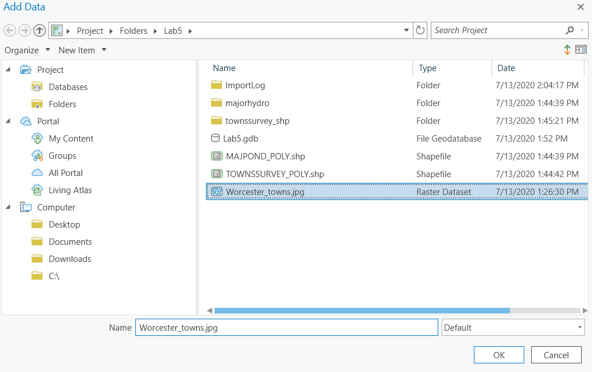 
        
    2.  You will get the by now familiar Unknown Spatial Reference
        warning. This is OK\! This is the problem that you are about to
        fix\! Click the X to dismiss the dialog.
    3.  ***The image will not appear in the map initially.*** Since it
        is not a spatial layer, ArcGIS does not know how to display it.
        Nonetheless, `Worcester_towns.jpg` will be listed in the **Contents** pane, so
        you will know that it is there, and be able to change Layer
        properties in the next step. Even though you can't see an image,
        keep following the instructions. You won't be able to see the
        image until you begin the Georeferencing process.
6.  Make sure the `Worcester_towns.jpg` layer is selected in the **Contents** pane.  On the contextual **Appearance** tab, change the **Resampling Type** to **Cubic**.  This will improve the quality of the display. 
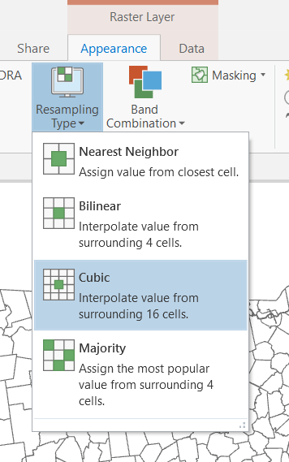 

The data are now available in your map and you are ready to
begin Georeferencing.

1.  With the `Worcester_towns.jpg` layer still selected, click the **Imagery** tab and select **Georeference**. The **Georeference** tab will appear in place of the **Map** tab. The Georeferencing tools are contained here, and each group of the tab corresponds to a step in the process. 
2.  Notice that the Georeferencing window on your map shows you details about the layer you are currently working on, which is currently `Worcester_towns.jpg`.
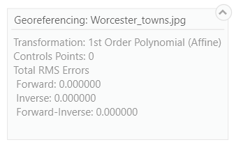 

3.  On the **Georeference** tab, select **Fit to Display**. The JPEG image will now appear in the visible part of
    the map canvas, along with the rest of the layers you added. However, the scale and position of the historic towns layer is incorrect relative to the shapefile layer. 

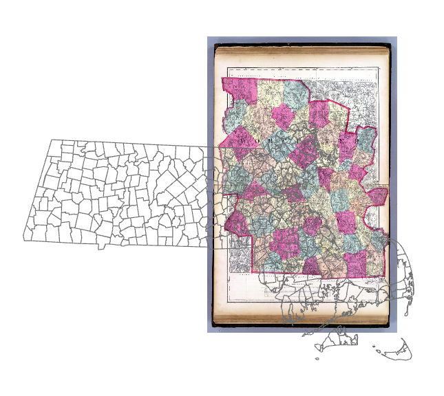 

You are now ready to begin placing **ground control points** (GCPs). The
GCPs link coordinates from the towns shapefile (already referenced) with the image of the historical map (not yet referenced).

1.  On the **Georeference** tab, click the **Add Control Points** button.
    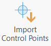
2.  Place the first GCP:
    1.  Look at the modern towns layer and the map to identify (by
        shape, or possibly by name - you will need to turn on labels to identify these) a town that is the same in both data sources.
    2.  Click on a corner of the town in the JPEG image. **Note:** You
        *must* click on the historical image *first*.
    3.  Click on the matching corner of the same town in the `TOWNSSURVEY_POLY`
        layer. The image will immediately reposition itself so that that
        point in the two data sources are aligned. The scale (size of
        the towns) will (probably) still be off.
    4.  Repeat the process for another (perhaps the opposite) corner of
        the same town. The image will now be rescaled to approximately
        the same size as the modern towns layer. It won't be perfect,
        but even with only two GCPs, it should now be visibly obvious
        that the two data sources are slightly different versions of the
        same real-world entities.
3.  Place additional GCPs. As you place additional points, the image
    will align more and more closely to the modern data. Be sure to add
    pairs of GCPs to different parts of image – do not bunch your GCPs
    in just one area of the image.
4.  In addition to visually assessing the fit, you should also evaluate
    the fit using the residuals and **root mean square (RMS) error**.
    Click the **Control Point Table** button  on the **Georeference**
    tab to view the table with all the GCPs and their residuals.
    
    
    

    The residual tells you how much discrepancy lies between
    the reference data (modern towns layer) and the JPEG image. Values
    close to 0 indicate that you are doing a good job. 
    
5.  The RMS error values are displayed in the georeferencing box in the map window. Note that if you delete or temporarily remove a GCP, the RMS error will update in that box.

    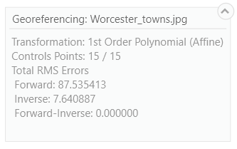
    
    You may find that the fit is be improved by deleting some points. If the RMS error reaches 0, you have perfect fit. You can delete control points that
    have a very large residual by highlighting them in the control point table and clicking the **Delete Selected** button.
    
    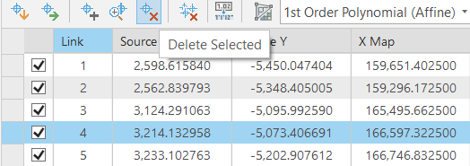
    
6.  Continue placing additional GCPs. Ideally, your control points will
    be well-distributed across the map. We can't know the number of
    required GCPs in advance. The process is iterative. As you place
    additional points, you will evaluate the fit, erase the ones with a
    poor fit, add new points to improve the fit, etc. **Note:** The next
    section of the lab will focus on digitizing features in the town of
    Auburn, so please prioritize the fit in Auburn.
7.  When you are satisfied with your GCPs, you will want to save the
    JPEG as a new image.
    1.  Select **Save as New** from the Georeference tab to export the raster.
    
    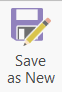
    
    2.  Specify the name and location of your georeferenced raster in your Lab 5 folder. You do not need to type in a file extension.
    3.  Make sure the coordinate system is set to `NAD_1983_StatePlane_Massachusetts_Mainland_FIPS_2001`. You should not need to change this.
    4.  For **Output Format**, choose 'TIFF'. 
    5.  TIFF images can be very large. Change the **Compression Type** to
        JPEG. **Compression Quality** can stay at the default value (which
        should be 75).
    6.  Click Export. The georeferenced TIFF should automatically be added to your map.
    7.  Save your control points as a text file by clicking the **Export Control Points** button, and navigating to your workspace folder. You will be able to import them again if you lose your work at any point. End the georeferencing process by clicking the **Close Georeference** button.
    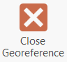
    8.  Remove the original imagery layer from the map, and view the georeferenced historical map on top of the town shapefile.

## Digitizing

For historical research, the researcher/analyst will often need to
**digitize** features by referring to an historical map. This process transforms analog imagery into digital features, such as points, lines or polygons. Now that you have finished geoferencing the towns map, you can begin digitizing
features drawn on the map. We are going to digitize the lakes in the
town of Auburn and compare the historical locations of these lakes to
the current water bodies taken from a modern GIS layer.

A video of this digitizing tutorial is available at
<https://drive.google.com/file/d/0B_rk0_Y4N6QzWFFDclRUcnE3TkU/view> and
a brief description of the steps follow. Review the steps below and watch the video before beginning the tutorial.

1.  Add the georeferenced TIFF (the result of the previous section) to
    the map document if not 
2.  Zoom in to the town of Auburn (you can identify Auburn in the
    `TOWNSSURVEY_POLY` attribute table).
3.  Open the **Catalog** pane and navigate the catalog tree
    to get to your workspace folder.
4.  Right-click on your Lab 5 folder and select **New→Shapefile**. This will open the **Create Feature Class** pane.
    1.  For **Feature Class Location**, choose your workspace folder.
    2.  For **Feature Class Name**, type 'Lakes_auburn'.
    3.  For **Geometry Type**, select 'Polygon'.
    4.  For **Coordinate System**, select the `TOWNSSURVEY_POLY` layer. The input will change to the name of the coordinate system of the the towns layer, and the new (empty) shapefile will now have the same spatial reference information. Any features that you
        create will use coordinates from that coordinate reference system.
    5.  Click Run.
    

5.  The new shapefile will be created in the selected
    folder and added to the **Contents** pane. (If it does not get added to the map automatically, you can use the **Add Data** button as usual.)
6.  Click on the **Edit** tab on the ribbon.
7.  Click the **Create** button to open the **Create Features** pane. Click on the `Lakes_auburn` layer to start creating features in that layer. Make sure that the **polygon** tool is selected.
    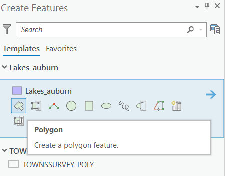

8.  Select the **line** tool on the construction toolbar to draw straight line segments.
    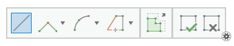

9.  Begin tracing the outline of one of the lakes in the town of Auburn.
    The lakes are darker shaded polygons, for example those found within
    the areas circled below. 
    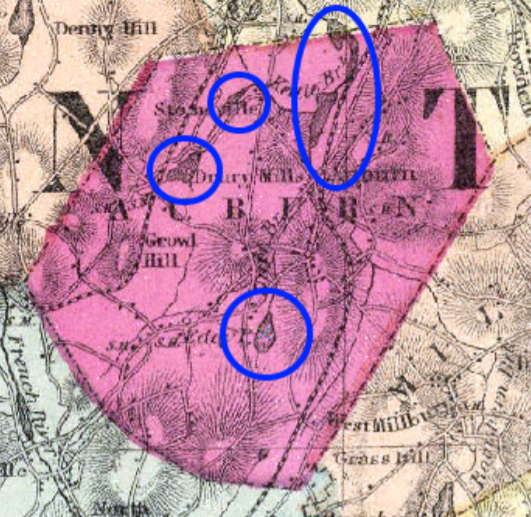 
    
10. Each click will add a **vertex** to the
    polygon. Draw the polygon with a series of closely spaced clicks.
    Where the boundary is curved, you will have to add more vertices to
    follow the curve. Where the boundary is straight, the vertices can
    be more spread out.  
11. If you need to correct
    the position of any points as you are adding vertices, you can hit **Ctrl+Z** to undo the last point and add it again. 
12. When you have finished one polygon, double-click on the final vertex (connecting the first one to the last) to complete the
    sketch. The polygon will be outlined in teal, indicating that the
    shape is complete.
13. On the **Edit** tab, click **Save** so that
    you do not lose any work.
14. Digitize all of the lakes in the town of Auburn. When you are
    finished, save your edits once again, and close the **Create Features** pane.  Clear the selection.
15. Add the `MAJPOND_POLY.shp` layer to compare the locations of lakes
    in 2019 and 1871.

# ASSIGNMENT

## Objective

Recently, there were a number of articles about the shrinking Great Salt
Lake in Utah <https://earthobservatory.nasa.gov/IOTD/view.php?id=88929>.

Your objective is to investigate how much the Great Salt Lake in Utah
has changed in size since 1889. You will start with an image file of a
historical map of Utah, and a layer of Utah counties:

  - [Utah\_1889.jpg](https://github.com/temple-geography/fundamentals-of-gis/raw/master/data/Utah_1889.jpg)
    is a JPEG image of an historical 1889 map of Utah [originally
    downloaded from
    DavidRumsey.com](https://www.davidrumsey.com/luna/servlet/detail/RUMSEY~8~1~37442~1210316:Utah-?showTipAdvancedSearch=false&showShareIIIFLink=true&showTip=false&helpUrl=https%3A%2F%2Fdoc.lunaimaging.com%2Fdisplay%2FV73D%2FLUNA%2BViewer%23LUNAViewer-LUNAViewer&title=Search+Results%3A+List_No+equal+to+%272094.058%27&fullTextSearchChecked=&dateRangeSearchChecked=&advancedSearchUrl=https%3A%2F%2Fdoc.lunaimaging.com%2Fdisplay%2FV73D%2FSearching%23Searching-Searching&thumbnailViewUrlKey=link.view.search.url).
  - Download zipped shapefile of modern Utah counties boundaries:
    <https://drive.google.com/a/utah.gov/uc?id=0ByStJjVZ7c7mc3BGRXhKa0N0U2c&export=download>.

For this assignment you are to georeference the image, digitize the
perimeter of the Great Salt Lake, and compare the digitized historical
lake boundary to more recent representations of the lake boundary as
captured in satellite imagery within Google Earth.

## Deliverables

**Turn in a report in the format described in the syllabus.**

Be sure to include the following information:

1.  The RMS error of your control points, after you have completed
    georeferencing the historical map.
2.  A map of the digitized 1889 Great Salt Lake polygon you digitized
    overlain on the historical 1889 image of Utah.
3.  An image of the digitized Great Salt Lake polygon overlain on the
    modern satellite imagery of the lake in Google Earth.

The **Introduction** section should state the research objective and the
relevant criteria for selecting the neighborhoods and schools.

The **Data and Methods** section should state the data sets used in the
analysis, from where those data were acquired, and the GIS operations
employed. Be sure to address your methods for georeferencing and
digitizing, and to justify why you chose specific mapping options.

The **Results** section should state the results (i.e. your assessment
of the change in size of the lake over time). Include the RMS error derived
from the image georefrencing and an evaluation of the digitizing
quality. The map should be cited in the text here (e.g. Figure 1).

The **Discussion** section should state an interpretation of the results
(i.e. how and, briefly, why, has the size of the Great Salt Lake changed
over this time period), limitations of the analysis, and how the
analysis could be improved or expanded.

The **Tables and Figures** section should contain the map, with a
caption. The map should be cited in the text.

## Getting Started

1.  Georeference Utah\_1889 to the modern county boundaries. There have
    been changes in county boundaries between the historical and modern
    period, so you should look for obvious points of correspondence,
    beginning with the six corners of the state of Utah. Don't forget to
    note the RMS error when you are through digitizing, as the control points will be lost if you stop georeferencing and do not save the table.
2.  Digitize the 1889 perimeter of Great Salt Lake as a polygon.
3.  Save the polygon shapefile as a **Layer** file (.lyrx extension) and then convert to **KML**
    file for viewing in Google Earth. This will allow you to visually
    compare the historic extent of the Great Salt Lake to its current
    extent. A **layer** in ArcGIS references a spatial data set and includes
    a set of rules for how it should be displayed. (Think how a layer in
    ArcGIS is both a pointer to a data source and rules about how to
    display it.) To create the KML file:
    1.  Change the symbology of the shapefile to a fill of 'No Color' with a 2
        point border in a bright color.
    2.  Right-click the layer in the **Contents** pane and select **Sharing→Save as Layer File**.
        Save it to your working folder.
    3.  Use the **Layer to KML** tool to create a new **KMZ** file (a zipped
        **KML** file). This tool is found in the Toolbox under **Conversion
        Tools→KML→Layer to KML**. The input file will be the layer file
        that you just saved.
4.  Once the KML layer is exported, launch Google Earth. Click **File→Open** and navigate to your KML file, and add it to the map. In Google Earth you can access imagery since 1970 by clicking on
    the button that looks like a clock with an arrow pointing
    counterclockwise.
5.  After exploring the past imagery, set the clock to the most recent
    available imagery. You can export the image as a jpg, with the lake
    polygon you added overlain, by going to **File→Save→Save Image**.
